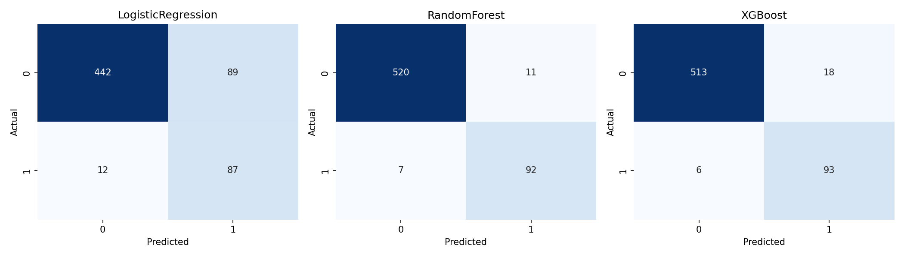
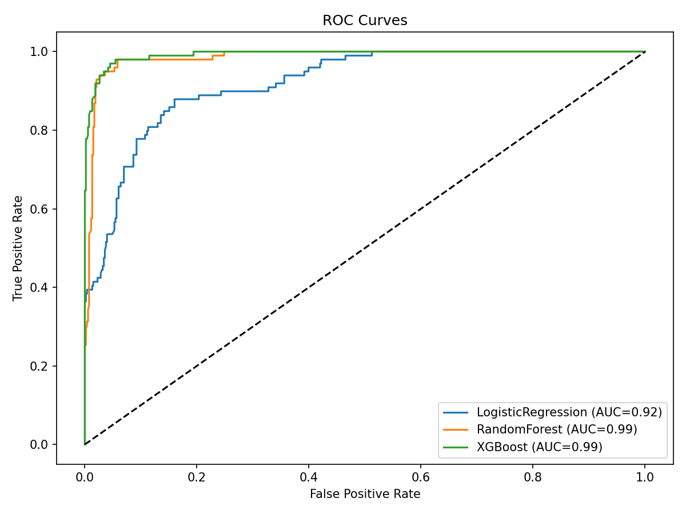
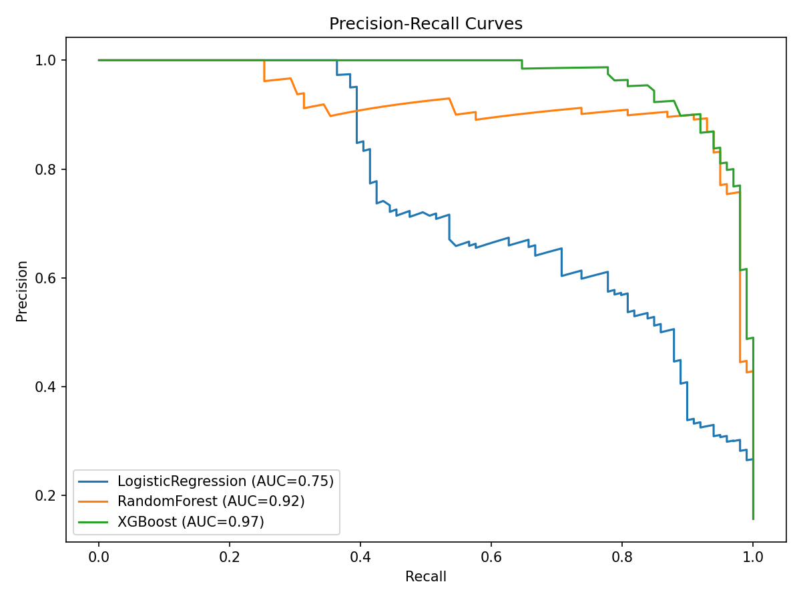
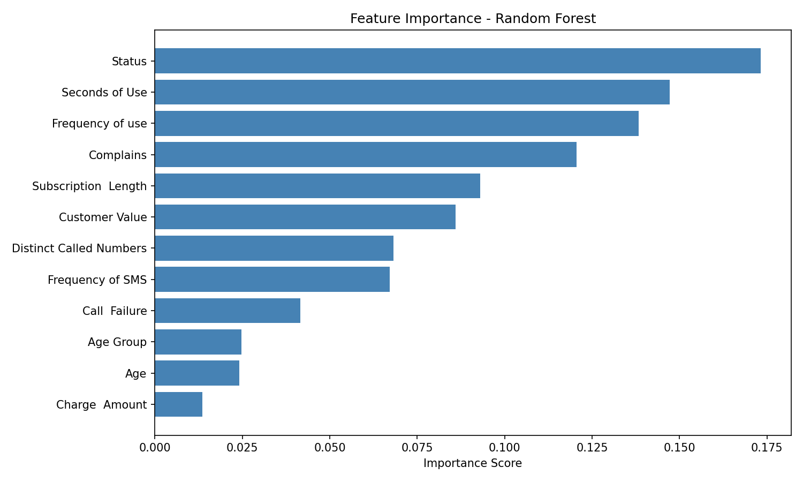
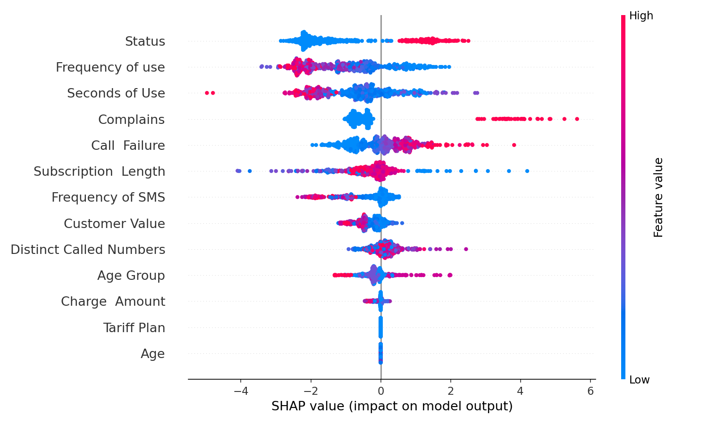

# Customer Churn Prediction

A complete end-to-end machine learning pipeline that predicts whether a telecom customer will churn (leave) or stay. The project covers exploratory data analysis, model training with hyperparameter tuning, evaluation, explainability, and deployment-ready model saving.

---

## Problem Statement

Customer churn is one of the biggest challenges in the telecom industry. Losing a customer is far more expensive than retaining one. This project builds a system that identifies at-risk customers **before** they leave, giving the business time to take action.

---

## Dataset

| Property | Value |
|---|---|
| Total Customers | 3,150 |
| Features | 13 |
| Target | Churn (0 = Stayed, 1 = Left) |
| Churn Rate | 15.71% |
| Missing Values | None |

### Features

| Feature | Description |
|---|---|
| Call Failure | Number of failed/dropped calls |
| Complains | Whether customer raised a complaint |
| Subscription Length | How long they have been a customer |
| Charge Amount | Amount charged to the customer |
| Seconds of Use | Total call duration in seconds |
| Frequency of Use | How often the service is used |
| Frequency of SMS | Number of SMS messages sent |
| Distinct Called Numbers | Unique numbers the customer has called |
| Age Group | Customer age group category |
| Tariff Plan | Which plan the customer is on |
| Status | Account status |
| Age | Customer age |
| Customer Value | Revenue value of the customer |

---

## Project Structure

```
churn_prediction/
│
├── Customer Churn.csv          ← Raw dataset
│
├── Notebook/
│   ├── Churn_EDA.ipynb         ← Exploratory Data Analysis
│   └── Churn_Modelling.ipynb   ← Model training & evaluation
│
├── Main_file/
│   ├── Churn.py                ← Production-grade OOP pipeline
│   └── save_images.py          ← Exports all charts as PNG files
│
├── saved_models/               ← Trained models (.pkl files)
├── images/                     ← Output charts (.png files)
└── README.md
```

---

## Key Insights from EDA

- **Complaints are the strongest churn signal** — customers who complained had an **82.99%** churn rate vs **10.14%** for those who did not
- **Churned customers use the service far less** — avg 1,567 seconds vs 5,014 seconds for retained customers
- **Churned customers have lower value** — avg $124 vs $535 for retained customers

---

## Models Used

Three models were trained and compared, each with automatic class imbalance handling:

| Model | Imbalance Strategy |
|---|---|
| Logistic Regression | `class_weight='balanced'` + StandardScaler Pipeline |
| Random Forest | `class_weight='balanced'` |
| XGBoost | `scale_pos_weight` = ratio of non-churners to churners |

### Hyperparameter Tuning
- **GridSearchCV** — exhaustive search over all parameter combinations
- **Stratified 5-Fold Cross Validation** — preserves 15.71% churn ratio in every fold
- **Scoring metric: F1** — correct choice for imbalanced classification

---

## Results

| Model | Accuracy | Precision | Recall | F1-Score | ROC-AUC |
|---|---|---|---|---|---|
| Logistic Regression | 0.840 | 0.494 | 0.879 | 0.633 | 0.921 |
| **Random Forest** | **0.971** | **0.893** | 0.929 | **0.911** | 0.985 |
| XGBoost | 0.962 | 0.838 | 0.939 | 0.886 | **0.993** |

**Best model by F1: Random Forest** | **Best model by ROC-AUC: XGBoost**

---

## Visualizations

### Confusion Matrices
Shows true positives, false positives, true negatives, and false negatives for all three models side by side.



---

### ROC Curves
Measures the ability of each model to distinguish between churners and non-churners across all thresholds. Higher AUC = better model.



---

### Precision-Recall Curves
More informative than ROC for imbalanced datasets. Shows the trade-off between catching churners (recall) and avoiding false alarms (precision).



---

### Feature Importance (Random Forest)
Shows which features the Random Forest model relied on most when making predictions. Higher score = more important feature.



---

### SHAP Values (XGBoost)
SHAP (SHapley Additive exPlanations) explains **why** the model made each individual prediction. Each dot is one customer — red means high feature value, blue means low. Features at the top have the most impact on the prediction.



---

## Tech Stack

| Library | Purpose |
|---|---|
| `pandas` | Data loading and manipulation |
| `scikit-learn` | Model training, pipelines, evaluation |
| `xgboost` | Gradient boosting model |
| `shap` | Model explainability |
| `matplotlib` / `seaborn` | Visualizations |
| `joblib` | Saving and loading trained models |

---

## How to Run

### 1. Clone the repo
```bash
git clone https://github.com/Adnan082/churn_prediction.git
cd churn_prediction
```

### 2. Install dependencies
```bash
pip install pandas scikit-learn xgboost shap matplotlib seaborn joblib
```

### 3. Train models (run the notebook)
Open and run `Notebook/Churn_Modelling.ipynb` — this trains all models and saves them to `saved_models/`

### 4. Run the production script
```bash
python Main_file/Churn.py
```

### 5. Export charts as images
```bash
python Main_file/save_images.py
```

---

## Author

**Adnan Cheema**
- GitHub: [@Adnan082](https://github.com/Adnan082)
